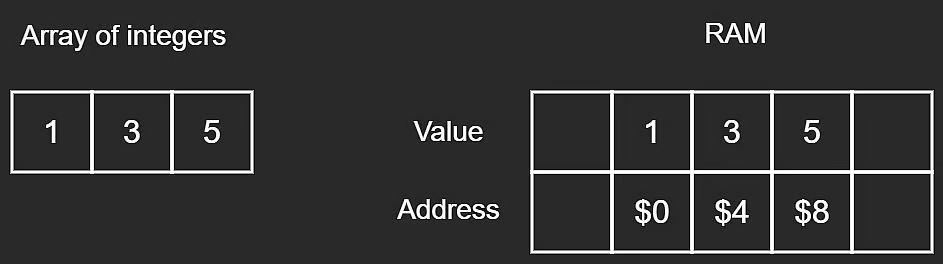
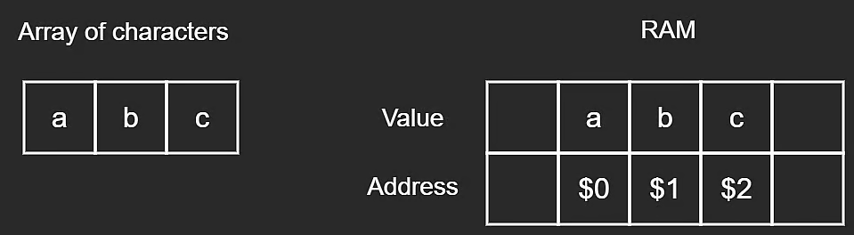

Before diving into what an array is, it is important to understand what a data structure is to begin with.

Simply put, data structures are a way to store data in an efficient manner inside the Random Access Memory, hereafter called "RAM". An array is a collection of ordered, contiguous group of elements. If we wanted to store three integers - 1, 3, 5 in our RAM, an array can be used. The question here is how does the computer store these numbers in the RAM if it only understands data in terms of bits - 0s and 1s. This requires understanding of the RAM. Computers these days have RAM in terms of gigabytes. In fact, the computer you are using to view this course might have 8 GB (109 bytes) of RAM. 1 byte = 8 bits. A bit is a 0 OR a 1.

Going back to our integers - 1, 3, 5, each one of them are stored in the RAM in terms of bytes, which gets converted to bits. Integers commonly occupy 4 bytes (32 bits) in memory. An address and a value gets associated with an integer upon storing it in RAM. An address is just a distinct location that each one of the values is stored at. Each value is stored contiguously in the RAM, just like an array.

Storing an integer array in RAM

**Each integer takes 32 bits of space, 4 bytes, hence the addresses are 4 bytes apart.**

Instead of integers, we could also store characters in an array.

Storing a character array into RAM. 

**Each character takes 8 bits of space, 1 byte, hence the addresses are 1 byte apart.**

Each character takes 8 bits of space, 1 byte, hence the addresses are 1 byte apart.
It does not really matter the size, or the type of value you store in the memory, as long as the address is incremented in accordance to the type of value being stored in the array. As software engineers, we don't need to worry about it since the operating system handles it for us. Still, it is good knowledge to possess.