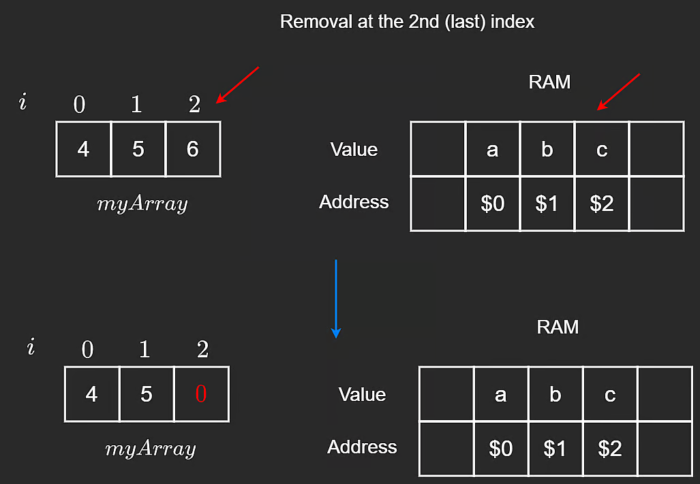
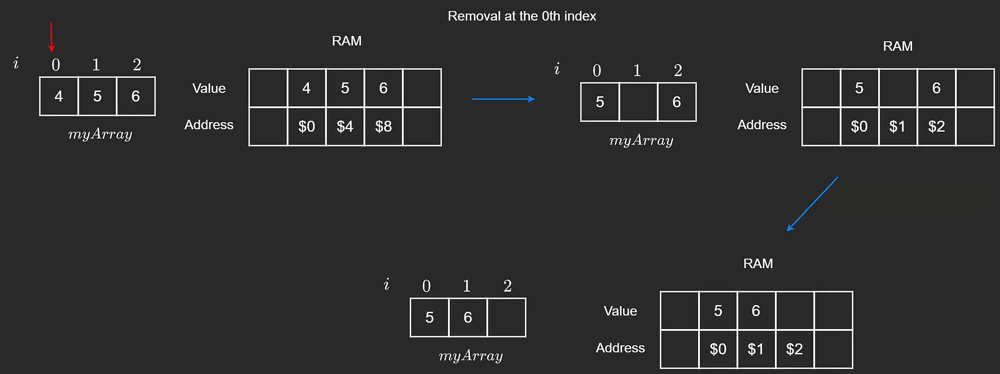
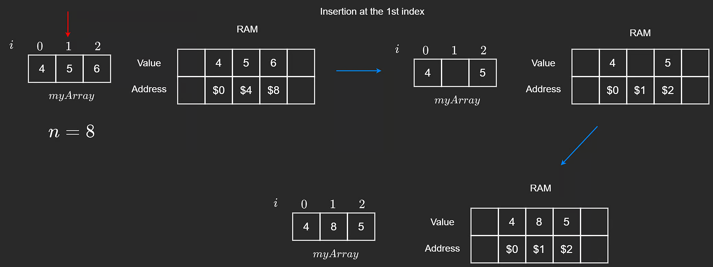
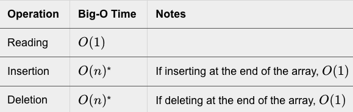

To recall, arrays are a way of storing data contiguously. In strictly typed languages like Java, C++, C# etc, arrays have an allocated size when initialized. This means that the size of the array cannot change after its initialization.

These are known as static arrays. Loosely typed languages such as Python and JavaScript do not have static arrays, which we will discuss in the next chapter.

It is essential to know the basic operations that can be performed on an array. The most common operations are:

- Reading
- Deletion
- Insertion

**Reading from an array**

Array elements are accessed through indices, which start at ***0*** in most languages. Reading from an array is as simple as accessing the index. For this example, we will be initializing an array of size ***3*** called myArray. Below is some example code to demonstrate a read operation.

```python

# initialize myArray
myArray = [1,3,5]

# access an arbitrary element, where i is the index of the desired value
myArray[i]

```

As long as the index of an element is known, the access is instant. This is because each index of myArray is mapped to an address in the RAM. Regardless of the size of the input array, the time taken to access our element – given that the index is known – will always be unaffected. We refer to this operation as 𝑂(1) in terms of time complexity.

**NOTE:** There is a common confusion that O(1) always fast. This is not the case. There could be 
1000operations and the time complexity could still be O(1). Similarly, an algorithm with 5 operations could also have a complexity of O(1). All O(1) really means is that the number of operations is constant relative to the input size.

**Traversing through an array**

Traversing refers to iterating through all the values in the array. We can choose to traverse through any part of the array we like. Below is code showing the traversal process from the start to the end of myArray.

```python

for i in range(len(myArray)):
   print(myArray[i])

# OR

i = 0
while i < len(myArray):
   print(myArray[i])
   i += 1

```

**NOTE:** length-1 is the last accessible index of the array. The last index of the array is n−1 if 
n is the size of the array. If the size of our array is 3, the last accessible index is 2.

Traversal through an array of size n is O(n). This means that the number of operations is linear to 
n. In the example above, if the size of n is doubled, the number of operations for traversal would also double.

**Deleting from the end of the array:**

In strictly typed languages, all array indices are filled with 0s or some default value upon initialization, denoting an empty array. When we want to remove an element from the last index of an array, setting its value to 0 / null or -1 does the job. While it is not being "deleted" per se, this overwriting denotes an empty index. We will also reduce the length by 1 since we have one less element in the array after deletion. The code below demonstrates the concept using [4, 5, 6] as an example.

```python

# Remove from the last position in the array if the array
# is not empty (i.e. length is non-zero).
def removeEnd(arr, length):
    if length > 0:
        # Overwrite last element with some default value.
        # We would also consider the length to be decreased by 1.
        arr[length - 1] = 0

```



6 is deleted/overwritten by either 0 or −1 to denote that it does not exist anymore. Length is also decremented by 1.

**Deleting at an ith index:**

Using the same instance of myArray from the previous example, let’s say that instead of deleting at the end, we wanted to delete an element at a random index i. Would we be able to perform this in O(1)? We could just replace it with a 0 and call it a day. But this would break the contiguous nature of our array.

Notice that we did not worry about having to maintain a contiguous order when deleting at the last index but now we have to. Okay, so how do we achieve this? Given the target index i, we can iterate from i + 1 until the end of the array and shift each element 1 position to the left. In the worst case, we will need to shift all of the elements to the left.

```python

# Remove value at index i before shifting elements to the left.
# Assuming i is a valid index.
def removeMiddle(arr, i, length):
    # Shift starting from i + 1 to end.
    for index in range(i + 1, length):
        arr[index - 1] = arr[index]
    # No need to 'remove' arr[i], since we already shifted

```



In the worst case, n−1 shifts may be required. Therefore, the code above is O(n).


**Inserting at the end of the array:**

Since we can always access the last index of the array, inserting an element at the end of an array is O(1) time. Below is the code demonstrating the concept.

```python
# Insert n into arr at the next open position.
# Length is the number of 'real' values in arr, and capacity
# is the size (aka memory allocated for the fixed size array).
def insertEnd(arr, n, length, capacity):
    if length < capacity:
        arr[length] = n
```

length is the number of elements inside the array whereas capacity refers to the maximum number of elements the array can hold.


**Inserting at the ith index:**

Inserting at an arbitrary index i is a little bit more tricky. Given the state of myArray = [4, 5, 0] (where the last index is empty), if we are required to insert at index 1, or 0, we cannot overwrite because we would lose our current values. To insert, we will need to shift all values one position to the right. Below is the code and visual demonstrating this.

```python
# Insert n into index i after shifting elements to the right.
# Assuming i is a valid index and arr is not full.
def insertMiddle(arr, i, n, length):
    # Shift starting from the end to i.
    for index in range(length - 1, i - 1, -1):
        arr[index + 1] = arr[index]
    
    # Insert at i
    arr[i] = n
```

The visual above demonstrates that shifting occurs prior to insertion to ensure values are not overwritten.


